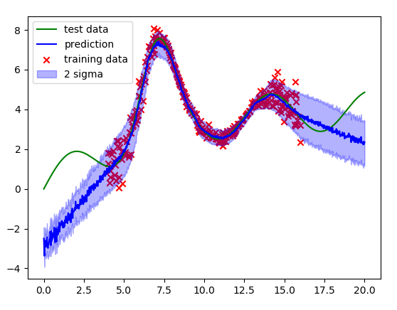

After reading [Yarin Gal's blog posts](https://www.cs.ox.ac.uk/people/yarin.gal/website/blog.html) on using dropout as a way to obtain uncertainty estimates for neural networks, I did a quick-and-dirty 1D implementation of a particularly interesting variant he describes which learns a heteroscedastic model of uncertainty (or target noise).

Heteroscedasticity (for the example data here) refers to the situation in which the observed variance/noise of the target variable (y) varies with respect to the input variable (x), in contrast to being constant (homoscedasticity).

The example model fit clearly shows that the model is able to express higher uncertainty about its prediction in regions where data is more noisy and while predicting low uncertainty where data is less noisy.

When working with real sensor measurements, heteroscedastic observation noise is a common "problem". For example, think of RGB-D cameras where the noise on the depth measurements is typically larger for measurements far away than close-by.

Implementation was done in PyTorch.
 
Source: <a href="https://github.com/SebastianRiedel/oneforall/tree/master/heteroscedastic_dropout_nn"><i class="large github icon"></i>on Github</a>
