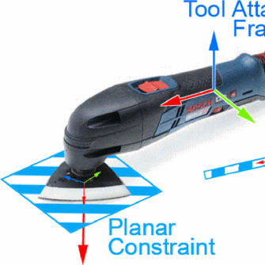
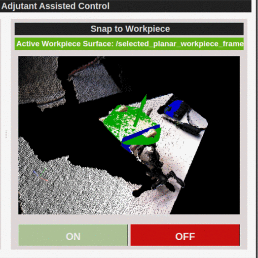
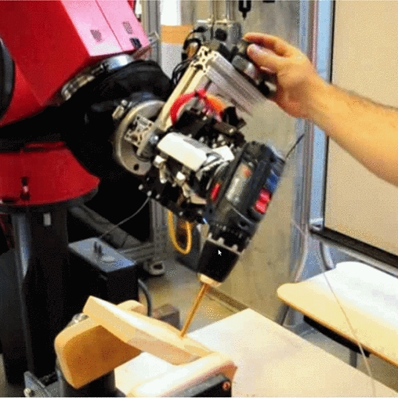

  
  
  
  

Flexible interaction and instruction is a key enabling technology for expanding robotics into small to medium scale manufacturing, in-home assistance for physically disabled individuals, and robotic surgery. In these cases, performing a task manually is neither practical nor scalable, yet complete automation is cost-prohibitive or impossible. Thus, our interest is in collaborative systems that can be easily trained to work with an operator. This collaborative robotic system should be instructable in a generalizable way for a wide range of tasks, and should generalize to new tasks gracefully with minimal retraining. At the same time, for a given task, the system should take advantage of user interaction modalities needed to accomplish the task, subject to the constraints of the available interfaces. These ideas motivate the Adjutant framework. Adjutant supports human-robot collaborative operations for ranges of user roles and robot capability. Adjutant models human-robot systems via sets of robot capabilities, composable high-level functions that can be specialized to specific tasks, and collaborative behaviors which relate these capabilities to specific user interfaces or interaction paradigms. Adjutant also incorporates several methods encapsulating reusable task information into capabilities, thus specializing them, including tool affordances, perceptual grounding templates, and tool movement primitives. We have implemented Adjutant as a software framework in ROS and, in this paper, explore the utility of Adjutant for performing several real-world collaborative manufacturing tasks on an industrial robot test-bed.

Publication: <a href="https://ieeexplore.ieee.org/abstract/document/6942739">Guerin, Kelleher R., Sebastian D. Riedel, Jonathan Bohren, and Gregory D. Hager. "Adjutant: A framework for flexible human-machine collaborative systems." In 2014 IEEE/RSJ International Conference on Intelligent Robots and Systems, pp. 1392-1399. IEEE, 2014.</a>

  <iframe src="https://drive.google.com/file/d/1SY22FvxzqOUPO08vG41fKPCf5bBPtKFn/preview" width="700" height="480"></iframe>

