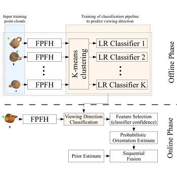
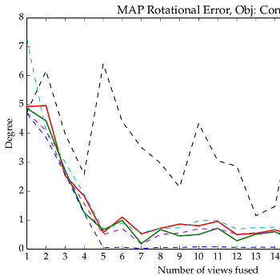
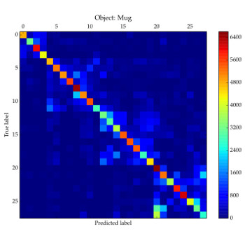

  
  
  
  

### Abstract

My Master-thesis considers the problem of active multi-view pose estimation of known objects from 3d range data and therein two main aspects: 1) the fusion of orientation measurements in order to sequentially estimate an objects rotation from multiple views and 2) the determination of informative object parts and viewing directions in order to facilitate planning of view sequences which lead to accurate and fast converging orientation estimates.

Addressing the first aspect, the Bingham probability distribution over 3d rotations, a parametric probability density function defined on the unit quaternion sphere, is investigated in a black box fusion task based on real data. The experiment shows that the resulting rotation errors are equal to fusion approaches based on pose clustering, a particle filter and a histogram filter while having the advantage of a continuous and parametric probabilistic representation.

To evaluate the informativeness of surface parts and viewing directions of an object with respect to orientation estimation, we present a conceptually simple approach based on the classification of locally computed 3d shape features to viewing directions they could be observed from during a training phase. At first, the applicability of the viewing direction classification to object orientation estimation is investigated. Secondly, the trained classification pipeline is used to determine informative viewing directions and discriminative local surface parts by analyzing the discrepancy between predicted and correct classifications on training data using the Kullback-Leibler divergence as information-theoretic measure of dissimilarity.

Experiments on simulated and real data revealed that the accuracy of the orientation estimation using the proposed method is not yet comparable to state-of-the-art algorithms in the general case of unrestricted viewing directions. The problem was identified as non-robustness of the classification to deviations from the discrete set of training view directions. The evaluation of view and surface part informativeness, however, gives plausible and promising results for building effective view planning criteria.

### Further Material
- [1] Riedel, Sebastian. Master-thesis: <a href="https://drive.google.com/open?id=1Jmj9WT3hGdlxXyPxH9vpFlyxfkus3mEV">"Bayesian Orientation Estimation and Local Surface Informativeness for Active Object Pose Estimation"</a>
- [2] Riedel, Sebastian, Zoltan-Csaba Marton, and Simon Kriegel. <a href="https://ieeexplore.ieee.org/abstract/document/7501381">"Multi-view orientation estimation using Bingham mixture models."</a> In 2016 IEEE international conference on automation, quality and testing, robotics (AQTR), pp. 1-6. IEEE, 2016.
- [3] Riedel, Sebastian, Zoltan-Csaba Marton, and Simon Kriegel. <a href="https://pdfs.semanticscholar.org/8046/a157adef94c4ad3c85935a6defd20c88a432.pdf">"Viewing Direction Classification: Application to View Planning."</a>
- [4] Márton, Zoltán Csaba, Serkan Türker, Christian Rink, Manuel Brucker, Simon Kriegel, Tim Bodenmüller, and Sebastian Riedel. <a href="https://link.springer.com/article/10.1007/s10514-017-9633-1">"Improving object orientation estimates by considering multiple viewpoints."</a> Autonomous Robots 42, no. 2 (2018): 423-442.

**Technology Stack:** C++, Python, Cython, PCL, Scikit-Learn, libbingham

**Work Affiliation:** German Aerospace Center (DLR), Technical University Munich (TUM), under supervision of Zoltan-Csaba Marton, Simon Kriegel and Prof. Darius Burschka
