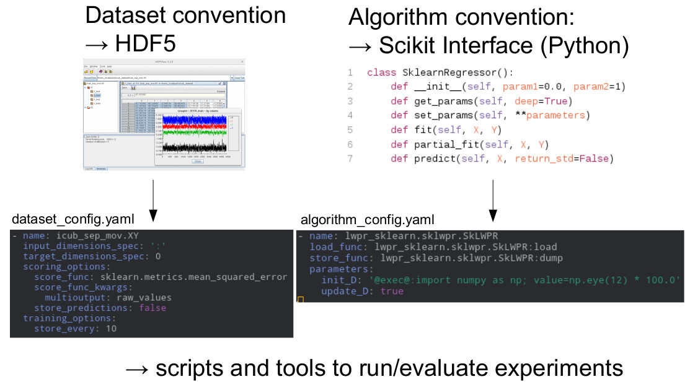

### Highlights
- standardized interfaces for datasets (including meta-data) and algorithms
- management of generated artifacts and configuration/parametrization options for full data/model lineage and traceability
- utility tools for analyzing and visualizing results along any experiment dimension (dataset variants, algorithm variants, parametrization variants, etc.)

**Technology Stack:** Python, HDF5, Pandas, SLURM, Dask Distributed, Scikit-Learn

**Work Affiliation:** German Aerospace Center (DLR)
