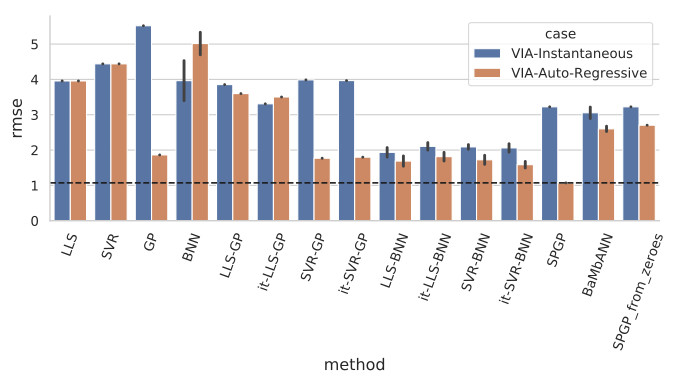

We evaluated semi-parametric Gaussian process regression (SPGP) and a novel model-based neural network architecture (BaMbAnn), and compared their modeling accuracy to a series of naive semi-parametric, parametric-only and non-parametric-only regression methods. The comparison has been carried out on three test scenarios, one involving a real test-bed and two involving simulated scenarios, with the most complex scenario targeting the modeling a simulated robot’s inverse dynamics model.

### Further Material
- [1] Technical Report: Sebastian Riedel, and Freek Stulp. <a href="https://drive.google.com/open?id=1Pij_EJf6DaEHA-z5PHdUaQy_io5_LHLi">"Comparing Semi-Parametric Model Learning Algorithms for Dynamic Model Estimation in Robotics"</a> [Draft]

**Technology Stack:** Python, Tensorflow, Scikit-Learn, C++, Limbo

**Work Affiliation:** German Aerospace Center (DLR), in collaboration with Florian Loeffl
