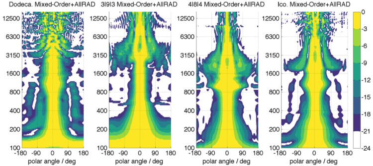

### Abstract

Compact spherical loudspeaker arrays are used to produce sound sculptures in electroacoustic music by modal beam- forming that orchestrates the wall reflections in the given space.Performance practice predominantly uses beams in the horizontal plane as they most effectively produce audi- tory objects via lateral reflections on unobstructed, close- enough walls and baffles. Revisiting mixed-order schemes, this contribution reveals ways to boost the horizontal di- rectivity of the dodecahedral loudspeaker from second to third order, of the icosahedral loudspeaker from third to fourth, and for similar directivity, new special mixed-order layouts are presented with significantly reduced number of transducers. Moreover, a two-band approach is tested with a lower band in which the modal beamforming is fea- sible with short crosstalk cancellation filters, and with a high-frequency band using AllRAD as amplitude panning approach to minimize spatial aliases and side lobes.

### Further Material
- [1] Stefan Riedel, Franz Zotter, Robert Hoeldrich. <a href="https://www.researchgate.net/publication/333132335_Design_and_Control_of_Mixed-Order_Spherical_Loudspeaker_Arrays">"Design and Control of Mixed-Order Spherical Loudspeaker Arrays."</a>  2019 ICMC (International Computer Music Conference) New York City (Best Paper Award).
- [2] Stefan Riedel. Master-thesis: <a href="https://drive.google.com/open?id=1hyXaX3AxoZvnzQgYCSvq5RE_f2y24E8j">"Compact Spherical Loudspeaker Arrays: New Ideas on Filter and Layout Design"</a>

**Technology Stack:** Ambisonics, Matlab, CAD, 3D printing

**Work Affiliation:** Institute of Electronic Music and Acoustics, University of Music and Performing Arts Graz. In collaboration with Ass.Prof. Dr. Franz Zotter and Prof. Dr. Robert Hoeldrich.

