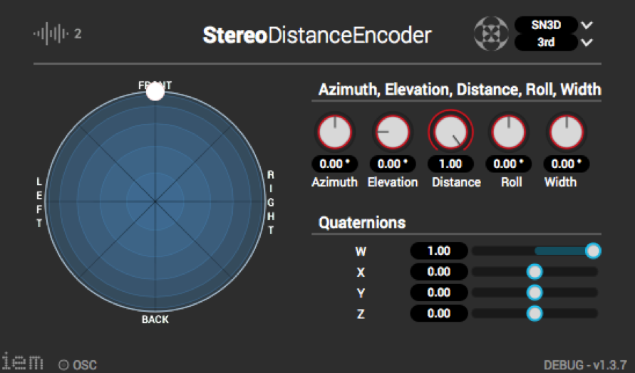

### Abstract

This work introduces distance-coded Ambisonics formats and their reproduction on headphones and loudspeaker arrays.

The first simple and practically motivated format proposes two Ambisonic signals, a far-field and a near-field signal, to which sounds are distributed according to a distance parameter at encoding stage (see image of extended IEM plug-in). In binaural decoding this enables the application of near-field HRTFs with inherent binaural cues which cannot be applied at encoding stage, for example the frequency-dependent increase in interaural level differences compared to far-field HRTFs. Blending between two Ambisonic reverberation patterns (modeled or measured DRIR) is combined with a physically meaningful level attenuation to achieve a plausible distance effect that includes a change in the direct-to-reverberant sound energy ratio. Compatibility with loudspeaker arrays is given by summation of the two Ambisonic signals after introducing level differences and the two reverberation patterns to retain a relative distance effect.

An efficient and more accurate way to render distance is to restrict the effect to the horizontal plane. Therefore, a second format that interprets negative elevation as the distance of a horizontal source is proposed. In binaural reproduction, this format allows for a high spatial resolution in the precomputation of distance-dependent HRTFs and early reflections, applied at decoding stage. Moreover, this format could motivate future research on loudspeaker systems that employ horizontal sound field synthesis (rendering of near-field sources) combined with AllRAD for elevated sources.

### Further Material
- [1] Stefan Riedel. Project-thesis: <a href="https://drive.google.com/open?id=1otwnnFGl2lz8Vx7_zucjXst-aeqBGTEd">"Distance-coded Ambisonics Formats and their Reproduction on Headphones and Loudspeaker Arrays"</a>
- [2] Binaural Audio Demos: <a href="https://soundcloud.com/stefan-mario-riedel-1/sets/ambisonic-binaural-near-field-demos">"Listen hear with your headphones."</a>

**Technology Stack:** Ambisonics, Matlab, JUCE, C++

**Work Affiliation:** 3D Audio Group, Eurecat Barcelona. In collaboration with Julien De Muynke.

