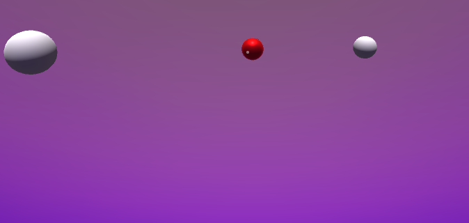

### Description

Work in progress on a project where I develop a controller for Ambisonics audio plug-ins. From the 360 scene in Unity I can control sound locations and move sound objects around to spatialize different instruments / tracks of music productions. 

**Technology Stack:** Unity, C#, Ambisonics, Reaper, 3D Graphic Design

**Work Affiliation:** Personal / Proprietary Project.

