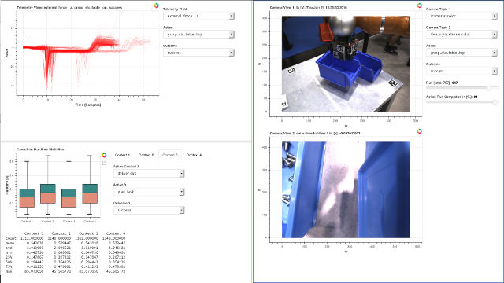

This should be a one or two sentence introduction to what the project is about and what the goal was. A bit more would be good for better formatting and that the next headline is full width. I can even add a third sentence so which explain why this is important or what I gained from this project in terms of lessons learned or what I found interesting about it.

### Accomplishments, Highlights, Responsibilities
- bullet one
- bullet two
- bullet three

### References, Further Material
- [1] Guerin, Kelleher R., Sebastian D. Riedel, Jonathan Bohren, and Gregory D. Hager. <a href="https://ieeexplore.ieee.org/abstract/document/6942739">"Adjutant: A framework for flexible human-machine collaborative systems."</a> In 2014 IEEE/RSJ International Conference on Intelligent Robots and Systems, pp. 1392-1399. IEEE, 2014.
- [2] bullet two

**Technology Stack:** Python, Dask, C++

**Work Affiliation:** German Aerospace Center (DLR)

**Source:** <a href="https://github.com/SebastianRiedel/oneforall/tree/master/heteroscedastic_dropout_nn"><i class="large github icon"></i>on Github</a>
